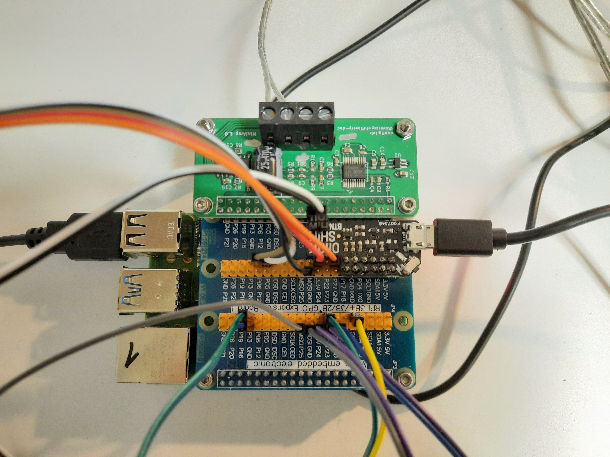

# Anleitung Phoniebox


## Beschreibung
- Abspielen von vielen Quellen:
  - Spotify
  - Youtube
  - MP3 ab SD-Karte
- Sound wird mit Tonie gestartet
  - Tonie hat Seriennummer, wird über Webinterface mit Aktion/Sound verknüpft
- Stopp über Play/Pause Knopf (Lauttärkeregler drücken). Stopp über Tonie entfernen nicht möglich
- Lautstärkeschritte, maximale Lautstärker im Webinterface einstellbar
- Ausschalten: Einschaltknopf 2-3 Sekunden drücken
- Augenbrauen leuchten, sobald Linux gestartet bis ausgeschaltet
- Zunge leuchtet, wenn Musikdienst bereit ist (bis System ausgeschaltet)
- Aufladen des Akkus und gleichzeitiger Betrieb ist nicht möglich
- Empfehlung: Konfiguriert euch einen NFC-Chip, der die IP-Adresse vorliest
- Hochladen von MP3s auf SD-Karte über Windows-Freigabe (Benutzername/Passwort gleich wie Kommandzeilenzugang) oder Webinterface

## Webinterface
1. Herausfinden, welche IP-Adresse die Phoniebox hat. Möglichkeiten:
    - Router-Einstellungen (Clients suchen)
    - Suchen mit Windows-Tools (z.B. Advanced IP Scanner)
    - Mit RFID Tag, der IP-Adresse vorliest (muss aber zuerst manuell konfiguriert werden!)
2. IP-Adresse in Browser eingeben (z.B. 192.168.254.104)
3. Voilà!


## Spotify Zugangsdaten eingeben
1. SD-Karte von Raspi in PC einstecken
2. Mopidy ggn. Spotify authentifizieren (client_id, client_secret beantragen): https://mopidy.com/ext/spotify/#authentication
3. Datei mopidy.conf anpassen (Benutzername und PW muss von Spotify sein, also nicht Facebook oder so):
    ```
    [spotify]
    username = BENUTZERNAME
    password = PASSWORT
    client_id = ... client_id value you got from mopidy.com ...
    client_secret = ... client_secret value you got from mopidy.com ...
    ```
4. Speichern (unbedingt mit UNIX-Zeilenende, nicht mit Windows-Zeilenende!!)
5. SD-Karte wieder in Raspi einsetzen und starten
6. Falls nicht funktioniert, nochmals überprüfen, ob UNIX-Zeilenenden gespeichert wurde


## Neues WLAN konfigurieren
1. Wenn im WLAN eingeloggt und Webinterface verfügbar, über Webinterface unter Einstellungen neue SSID und Passwort speichern.
2. Über SD-Karte
    1. Phoniebox abschalten.
    2. SD-Karte entfernen und in PC einstecken. 
    3. Datei wpa_supplicant.conf im Editor (z.B. Notepad++, nicht mit Windows Notepad) öffnen und folgendes einfügen (ssid und psk (Passwort) anpassen)
        ```
        ctrl_interface=DIR=/var/run/wpa_supplicant GROUP=netdev
        update_config=1
        country=CH

        network={
            ssid="MEIN_WLAN"
            psk="SUPER_PASSWORT"
        }
        ```
        Achtung, bei ssid und psk sind Gross-/Kleinschreibung relevant
    4. Speichern (unbedingt mit UNIX-Zeilenende, nicht mit Windows-Zeilenende!!)
    5. SD-Karte wieder in Raspi einsetzen und starten
    6. Falls nicht funktioniert, nochmals überprüfen, ob UNIX-Zeilenenden gespeichert wurde und ob SSID und PSK korrekte Gross-/Kleinschreibung haben

## Login
Über SSH (WLAN, Ethernet) oder mit Bildschirm (HDMI) und Tastatur oder über Netzwerkfreigabe (Windows Explorer \\\\192.168.xxx.xxx)

Benutzername: pi, Passwort: CncLaserLinuxli

Wichtige Kommandos:
```
sudo pip3 install mopidy-Iris mopidy_spotify mopidy --upgrade
sudo systemctl restart mopidy
cd RPi-Jukebox-RFID; git pull
sudo systemctl restart phoniebox-gpio-control.service
sudo journalctl -u phoniebox-gpio-control.service
```


## Verdrahtung / Pinout
Beschreibung                      | Modul Pin | Raspi HW Pin  | Raspi Pin name | Farbe
:-------------------------------- | :---------| :------------ | :------------- | :-
Hifiberry PCM CLK                 | 32 | 32 | GPIO12,PWM0     | -
Hifiberry PCM FS                  | 35 | 35 | GPIO19,PCM_FS   | -
Hifiberry PCM DIN                 | 38 | 38 | GPIO20,PCM_DIN  | -
Hifiberry PCM DOUT                | 40 | 40 | GPIO21,PCM_DOUT | -
Volume CLK                        | 1  | 29 | GPIO5  | ws
Volume DT                         | 2  | 31 | GPIO6  | br
Volume SW (Taster)                | 3  | 13 | GPIO27 | or
Volume 3V3                        | 4  |    | 3V3    | rt
Volume GND                        | 5  |    | GND    | sw
Taster weiter +                   |    | 16 | GPIO23 | vi
Taster weiter -                   |    | 14 | GND    | bl
Taster zurück +                   |    | 15 | GPIO22 | gn
Taster zurück -                   |    | 9  | GND    | ge
RFID Karte aktiv                  |    | 22 | GPIO25 | gr
LED Ready (rot, Zunge)            |    | 18 | GPIO24 | vi
LED Ready (rot, Zunge) GND        |    | 20 | GND    | gr
LED Boot (weiss, Augenbrauen)     |    | 33 | GPIO13 | gn
LED Boot (weiss, Augenbrauen) GND |    | 39 | GND    | bl
Shutdown Taster                   |    | 11 | GPIO17 | sw/ws



## Basis
Idee von www.phoniebox.de, 
Code basiert auf https://github.com/MiczFlor/RPi-Jukebox-RFID